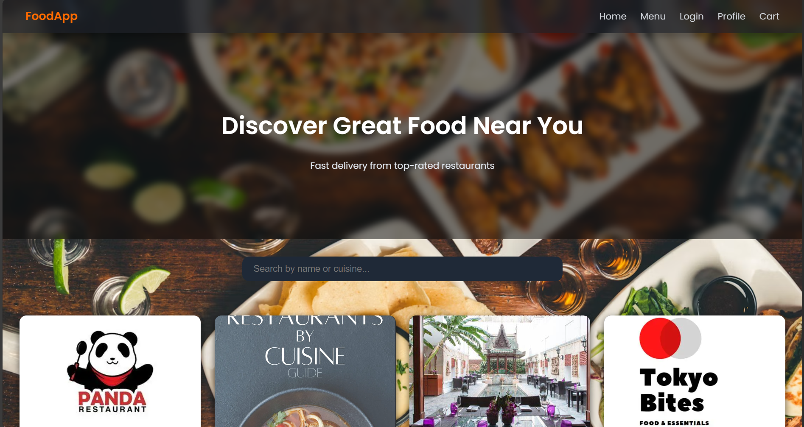

# Let's generate a README.md file with appropriate markdown content and save it for download.

readme_content = """
# FoodApp 🍔

FoodApp is a full-stack web application for online food ordering, built using **Core Java**, **JDBC**, **JSP**, **Servlets**, and **DAO Design Pattern**. The application mimics a Swiggy/Zomato-style platform where users can:

- Explore restaurants & cuisines
- Add food items to cart
- Place orders
- Manage profile with live image upload

---

## 🌐 Project Structure

FoodApp/
│
├── src/
│ ├── com.foodapp.model/ # JavaBeans (User, Restaurant, MenuItem, Order)
│ ├── com.foodapp.dao/ # DAO Interfaces
│ ├── com.foodapp.daoimpl/ # DAO Implementations (JDBC)
│ └── com.foodapp.servlet/ # Servlet Controllers
│
├── WebContent/
│ ├── css/ # Custom styling
│ ├── js/ # JavaScript (if used)
│ ├── images/ # Food and restaurant images
│ ├── login.jsp
│ ├── register.jsp
│ ├── menu.jsp
│ ├── cart.jsp
│ ├── profile.jsp
│ ├── restaurants.jsp
│ └── confirmOrder.jsp
│
├── lib/ # JDBC driver
├── README.md
└── web.xml # Servlet config

yaml
Always show details

Copy

---

## 🧩 Technologies Used

- Java (JDK 8+)
- JSP & Servlets (J2EE)
- JDBC (MySQL)
- HTML/CSS/JavaScript
- DAO Design Pattern
- MySQL (Backend DB)

---

## 📸 Screenshots

### 🏠 Home Page


### 🍽️ Restaurants


### 🛒 Menu & Cart


### 🔐 Login/Register


### 👤 Profile


### ✅ Order Confirmation


---

## 📦 Setup Instructions

1. Clone this repo:
    ```
    git clone https://github.com/your-username/FoodApp.git
    ```

2. Import into **Eclipse/IntelliJ** as a Dynamic Web Project.

3. Configure your database in `DBConnection.java`:
    ```java
    conn = DriverManager.getConnection("jdbc:mysql://localhost:3306/foodapp", "root", "password");
    ```

4. Run on Apache Tomcat Server.

5. Visit: `http://localhost:8080/FoodApp/`

---

## 🙌 Credits

Designed & Developed by [Singathala Bharathasimhareddy]

---

## 📄 License

This project is licensed under the MIT License.
"""

# Save the README content to a markdown file
file_path = "/mnt/data/README.md"
with open(file_path, "w") as file:
    file.write(readme_content)

file_path

👨‍💻 Author

Singathala Bharathasimhareddy

💼 Aspiring Full Stack Java Developer | Passionate about Web Development and Clean Code

📫 Let's Connect!

💼 [LinkedIn] https://www.linkedin.com/in/bharath-singathala

📧 Email:bharathsingthala@gmail.com

🧑‍💻 [GitHub] https://github.com/bharathsingathala

🌐 [Portfolio Website : https://portfoliosingathala.netlify.app/]

📍 Location: India

---
> _“Code is like humor. When you have to explain it, it’s bad.” S.bharathsimhareddy"
